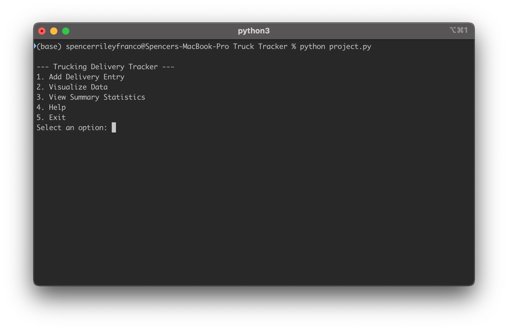
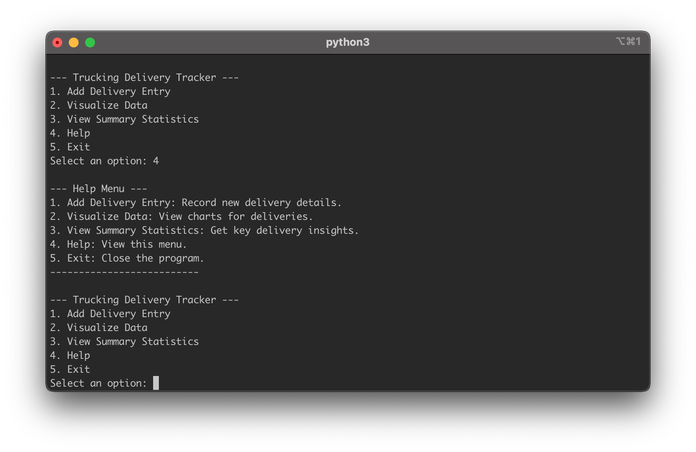
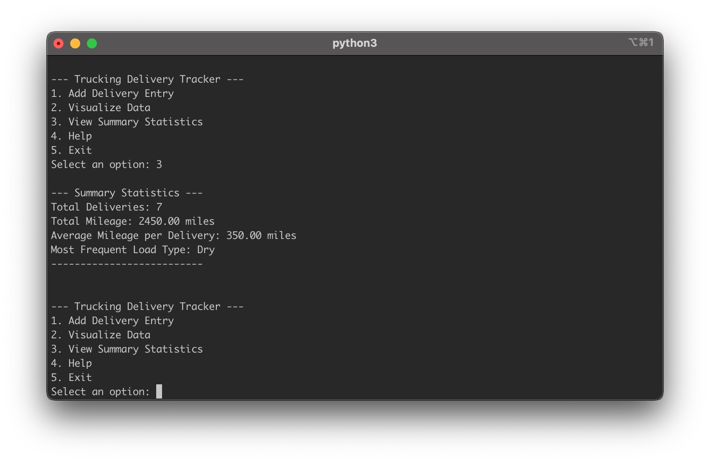
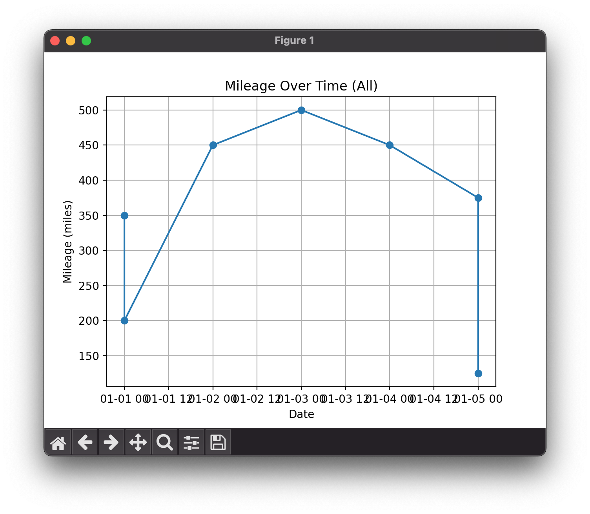
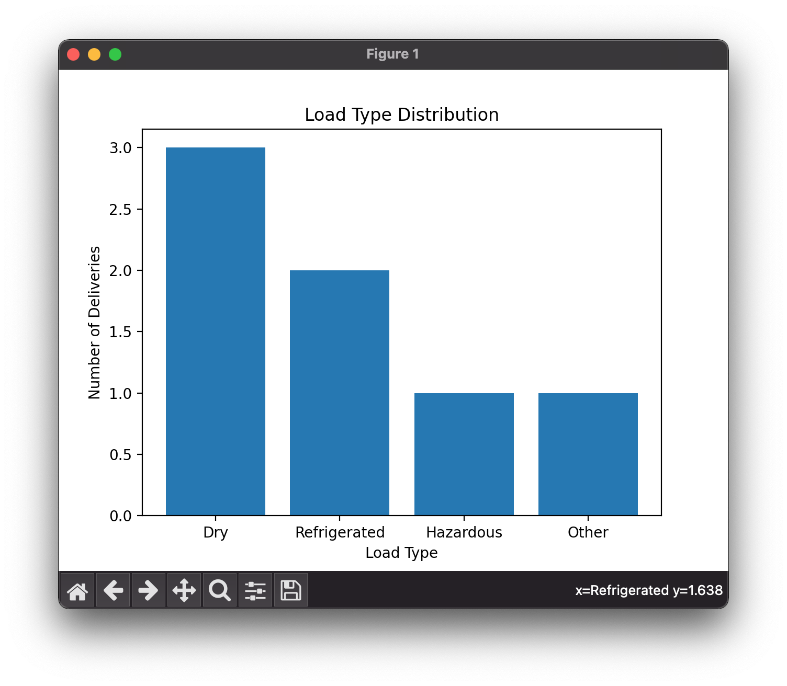

# Trucking Data Management System Project

#### Video Demo:  <URL HERE>


This project is a trucking delivery tracker I created to make my life easier when it comes to managing delivery data for a trucking business. It helps record, visualize, and analyze important metrics like mileage, load types, and delivery details. Basically, it’s a tool to keep everything organized while giving useful insights about the work I’m doing. Let me break it down for you.

---
## Screenshots

Click on a screenshot to view it in full size.

<div style="display: flex; flex-wrap: wrap; gap: 10px;">
    <a href="photos/image1.png" target="_blank">
        
    </a>
    <a href="photos/image2.png" target="_blank">
        
    </a>
    <a href="photos/image3.png" target="_blank">
        
    </a>
    <a href="photos/image4.png" target="_blank">
        
    </a>
    <a href="photos/image5.png" target="_blank">
        
    </a>
</div>

---


## What’s in the Files?

### `data_entry.py`  
This is where the magic of data collection happens. It’s all about getting the right inputs from the user (a.k.a. me). The functions in this file make sure the data is valid and consistent. Here’s the gist:
- **`get_date()`**: Makes sure dates are entered in the right format (`dd-mm-yyyy`) and even has a fallback to use today’s date if I’m feeling lazy.
- **`get_category()`**: Lets me categorize entries as either "Income" or "Expense" because knowing where the money comes from and where it goes is kind of important.
- **`get_description()`**: This is just for adding extra details if I want to, but it’s optional.  
Think of this file as the gatekeeper, making sure the data going into the system isn’t a total mess.

### `project.py`  
This is the heart of the project. It handles everything from storing data to generating charts that help visualize what’s going on. Here’s a quick rundown:
- **Class `CSV`**: Manages the CSV file where all the data lives. It can set up the file, add new entries, and pull existing data.
- **Interactive Functions**:
  - **`get_date()`**: Prompts me for a date and double-checks the format.
  - **`get_mileage()`**: Makes sure the mileage entered is a real number (and not negative, because that would be weird).
  - **`get_load_type()`**: Provides a menu of load types to pick from, so it’s not all free-text chaos.
  - **`visualize_data()`**: Turns the data into graphs, like mileage trends over time or the types of loads I’ve been hauling.  
  - **`show_summary()`**: Sums up the big picture: total mileage, average miles per delivery, and even the most common load type.  
If this file were a person, it’d be the multitasker who keeps everything running smoothly.

### `test_project.py`  
Testing is where I make sure things don’t break. This file has automated tests to check that all the pieces work the way they’re supposed to. For example:
- **Fixtures**: Set up a temporary test CSV file so I don’t accidentally mess with my real data.
- **Function Tests**: Checks whether adding entries, retrieving data, and user confirmations work as intended.  
This file is like the safety net to catch bugs before they become a problem.

### `requirements.txt`  
This file keeps track of the libraries I need for the project to work:
- **`pandas`**: Handles all the data wrangling.
- **`matplotlib`**: Creates those fancy graphs.
- **`pytest`**: Runs the tests to make sure everything works.  
It’s a straightforward but critical file for setting up the environment.

### `trucking_data.csv`  
This is where all the actual data goes. It has columns for dates, mileage, load types, and delivery details. It’s simple but gets the job done.

---

## Why I Made Certain Choices

1. **Using CSV for Storage**  
   I went with CSV because it’s easy to work with and doesn’t require a fancy database setup. Plus, it keeps things lightweight and portable—perfect for my needs right now.

2. **Interactive Input Checks**  
   The input validation functions are there to keep mistakes to a minimum. Trust me, I’ve had enough bad data entries in the past to know this step is worth the extra effort.

3. **Adding Visualizations**  
   The graphs aren’t just pretty—they’re useful. Being able to see mileage trends or what types of loads I’m hauling most often helps me make better decisions.

4. **Testing Everything**  
   Writing the tests took extra time, but it’s saved me so much frustration. Knowing the system works as it should gives me peace of mind.

5. **Keeping It Flexible**  
   The design is modular, which means it’ll be easy to add features down the road, like tracking fuel usage or even syncing with a database if I outgrow the CSV setup.

---

## Challenges and Ideas for Improvement

A couple of things gave me pause, like deciding to stick with a single date format (`dd-mm-yyyy`). It’s simple and consistent, but I know it might throw off anyone used to a different format. Another was the choice to use CSVs instead of a more advanced storage option. For now, it works fine, but if I ever need to scale this system, I’ll probably switch to a database.

Future plans? I’m thinking about adding a mobile app interface so I can log entries on the go. It would also be cool to track fuel usage and costs or add a feature to analyze routes for efficiency.

---

## **Conclusion**

This project does exactly what I need it to: keeps my trucking data organized, helps me spot trends, and gives me solid insights to work with. It’s simple, efficient, and—most importantly—easy to expand as my needs grow. I’m proud of what I’ve built here and excited to see how I can keep improving it.

## How to Use

1. **Setup**:
   - Clone the repository to your local machine.
   - Install dependencies:
     ```bash
     pip install -r requirements.txt
     ```

2. **Run the Application**:
   - Execute the program:
     ```bash
     python project.py
     ```

3. **Run Tests**:
   - Run all unit tests to ensure the program is functioning correctly:
     ```bash
     pytest test_project.py
     ```

4. **Features**:
   - Add delivery entries with date, mileage, load type, and delivery details.
   - Visualize trends and patterns in delivery data.
   - View key statistics to analyze delivery performance.

---

## Future Enhancements

- **Database Integration**: Replace CSV with a database for scalability.
- **API Support**: Enable data syncing with external systems.
- **Enhanced Visualizations**: Add more charts, like histograms and scatter plots.
- **Authentication**: Add user authentication for secure access to data.

This project provides a robust starting point for managing and analyzing trucking deliveries, with potential for significant expansion and customization.